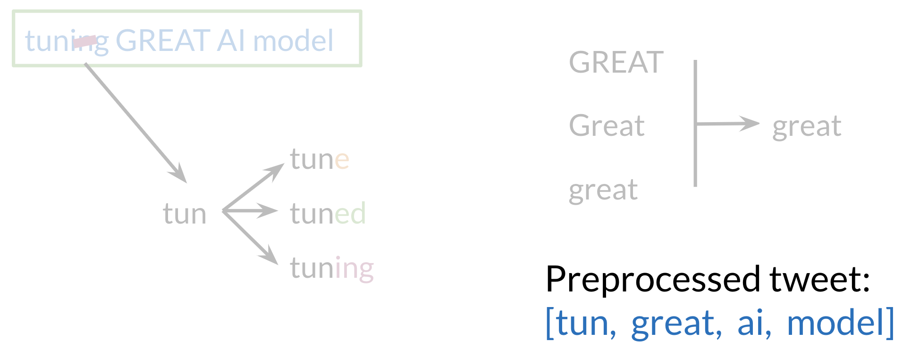

## Pre-processing

### Stopwords

Remove common english stopwords and punctuation from the text.

### Stemming

tuning GREAT AI Model

tun => {tune}
tun => {tuned}
tun => {tuning}

Objective : Reduce vocabulary in text.

Transform to lower case.

Great, GREAT and great are considered same. to avoid treating these same words as different embeddings in the feature vector.

